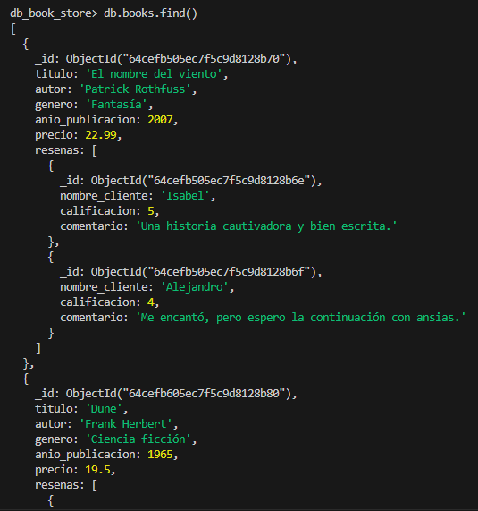
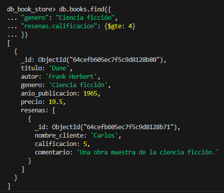
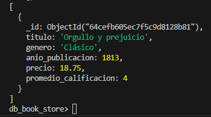
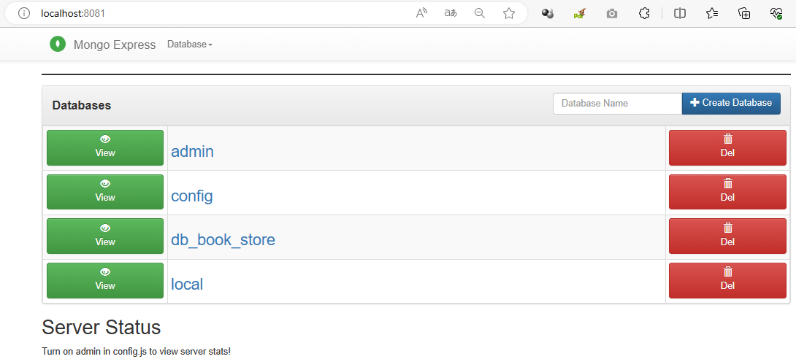
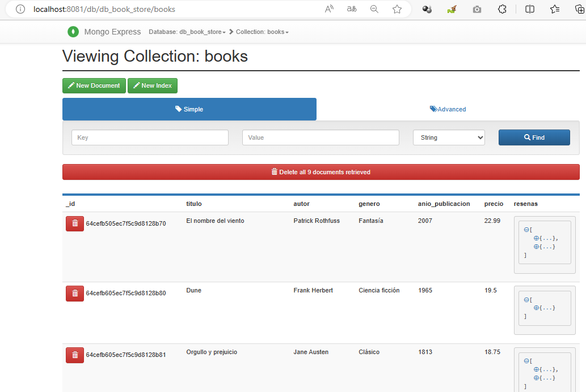

# Base de datos documental con MongoDB

El presente ejercicio pretende realizar una base de datos documental que contenga información de los libros disponibles en una tienda.

## Requerimiento

Diseño de una base de datos documental para una tienda de libros
Se te ha encomendado diseñar una base de datos documental para una tienda de libros en línea. La base de datos debe almacenar información sobre los libros disponibles, incluyendo el título, el autor, el género, el año de publicación y el precio. Además, se deben guardar las reseñas de los clientes para cada libro, que incluyen el nombre del cliente, la calificación y el comentario. Se conocen los siguientes requisitos:

- Cada documento de libro debe tener un identificador único.
- Las reseñas deben estar anidadas dentro de cada documento de libro.
- Se desea poder realizar consultas para encontrar los libros de un determinado género y con una calificación superior a un valor dado.

Diseña la estructura de la base de datos documental para cumplir con los requisitos mencionados.

## Propuesta de la estructura de la base de datos

Para cumplir con los requisitos mencionados, podemos utilizar una base de datos documental con MongoDB, que nos permitirá almacenar la información de los libros y sus reseñas de forma anidada. Aquí se presenta la estructura de la base de datos:

### **Base de Datos "db_book_store"**

**Colección "books":**

Campos:

_id: Identificador único del libro (Valor auto-generado por MongoDB).

titulo: Título del libro.

autor: Nombre del autor del libro.

genero: Género del libro.

anio_publicacion: Año de publicación del libro.

precio: Precio del libro.

resenas: Un arreglo que contendrá las reseñas de los clientes para este libro.


El esquema de la colección de libros permitirá almacenar cada libro como un documento independiente y anidar las reseñas dentro de él.

**Colección "resenas" (anidada):**

Campos:

_id: Identificador único de la reseña (Valor auto-generado por MongoDB).

libro_id: El _id del libro al que pertenece esta reseña.

nombre_cliente: Nombre del cliente que hizo la reseña.

calificacion: Calificación otorgada por el cliente (puede ser un número del 1 al 5, por ejemplo).
comentario: Comentario del cliente sobre el libro.

## Tecnologías utilizadas

- Docker
- Mongo DB
- Mongo Express

## Replicación del ejercicio

1. Clonar este repositorio.
2. Abrir una terminal en el directorio del repositorio clonado.
3. Ejecutar en la terminale el siguiente comando: 

```bash
docker-compose up -d
```
4. Ingresar a la consola del servicio mongodb con el siguiente comando:

```bash
docker exec -it mongo bash
```
5. Se imgresa a la línea de comandos con la siguiente instrucción:

```bash
mongosh -u root -p example
```

6. Podemos ver las bases de datos disponibles en Mongo:
```bash
show dbs
```

7. Se crea una base de datos **db_book_store** y se configura como la base de datos de trabajo:

```bash
use db_book_store
```

**Nota:** Mongo solo permite visualiar una base de datos que tiene al menos un documento, logicamente, 
previa creación de la **colección**

8. Se crea la colección **books**

```bash
db.createCollection("books")
```

9. Para insertar un solo documento, se usa el comando db.collection.insertOne():

```bash
db.books.insertOne({
  "titulo": "El nombre del viento",
  "autor": "Patrick Rothfuss",
  "genero": "Fantasía",
  "anio_publicacion": 2007,
  "precio": 22.99,
  "resenas": [
    {
      "_id": ObjectId(),
      "nombre_cliente": "Isabel",
      "calificacion": 5,
      "comentario": "Una historia cautivadora y bien escrita."
    },
    {
      "_id": ObjectId(),
      "nombre_cliente": "Alejandro",
      "calificacion": 4,
      "comentario": "Me encantó, pero espero la continuación con ansias."
    }
  ]
})
```
10. Para insertar varios documentos, se usa el comando db.collection.insertMany():

```bash
db.books.insertMany([
  {
    "titulo": "Dune",
    "autor": "Frank Herbert",
    "genero": "Ciencia ficción",
    "anio_publicacion": 1965,
    "precio": 19.50,
    "resenas": [
      {
        "_id": ObjectId(),
        "nombre_cliente": "Carlos",
        "calificacion": 5,
        "comentario": "Una obra maestra de la ciencia ficción."
      }
    ]
  },
  {
    "titulo": "Orgullo y prejuicio",
    "autor": "Jane Austen",
    "genero": "Clásico",
    "anio_publicacion": 1813,
    "precio": 18.75,
    "resenas": [
      {
        "_id": ObjectId(),
        "nombre_cliente": "Ana",
        "calificacion": 5,
        "comentario": "Una novela romántica encantadora."
      },
      {
        "_id": ObjectId(),
        "nombre_cliente": "David",
        "calificacion": 3,
        "comentario": "No es mi género favorito, pero reconozco su calidad."
      }
    ]
  },
  {
    "titulo": "La sombra del viento",
    "autor": "Carlos Ruiz Zafón",
    "genero": "Misterio",
    "anio_publicacion": 2001,
    "precio": 21.99,
    "resenas": [
      {
        "_id": ObjectId(),
        "nombre_cliente": "Laura",
        "calificacion": 5,
        "comentario": "Una historia que te atrapa desde la primera página."
      },
      {
        "_id": ObjectId(),
        "nombre_cliente": "Pedro",
        "calificacion": 4,
        "comentario": "Ambientación magnífica y giros sorprendentes."
      }
    ]
  },
  {
    "titulo": "Harry Potter y la piedra filosofal",
    "autor": "J.K. Rowling",
    "genero": "Fantasía",
    "anio_publicacion": 1997,
    "precio": 24.50,
    "resenas": [
      {
        "_id": ObjectId(),
        "nombre_cliente": "Elena",
        "calificacion": 5,
        "comentario": "El inicio de una saga épica, simplemente genial."
      },
      {
        "_id": ObjectId(),
        "nombre_cliente": "Carlos",
        "calificacion": 4,
        "comentario": "Un mundo mágico lleno de imaginación."
      }
    ]
  },
  {
    "titulo": "Cumbres borrascosas",
    "autor": "Emily Brontë",
    "genero": "Romance gótico",
    "anio_publicacion": 1847,
    "precio": 17.99,
    "resenas": [
      {
        "_id": ObjectId(),
        "nombre_cliente": "María",
        "calificacion": 5,
        "comentario": "Una historia intensa y apasionada."
      },
      {
        "_id": ObjectId(),
        "nombre_cliente": "Juan",
        "calificacion": 3,
        "comentario": "Un poco oscuro para mi gusto, pero bien escrito."
      }
    ]
  },
  {
    "titulo": "Los pilares de la Tierra",
    "autor": "Ken Follett",
    "genero": "Histórico",
    "anio_publicacion": 1989,
    "precio": 26.75,
    "resenas": [
      {
        "_id": ObjectId(),
        "nombre_cliente": "Ana",
        "calificacion": 5,
        "comentario": "Una novela épica, llena de intriga y drama histórico."
      },
      {
        "_id": ObjectId(),
        "nombre_cliente": "Miguel",
        "calificacion": 4,
        "comentario": "Una lectura fascinante que te transporta en el tiempo."
      }
    ]
  },
  {
    "titulo": "To Kill a Mockingbird",
    "autor": "Harper Lee",
    "genero": "Drama",
    "anio_publicacion": 1960,
    "precio": 20.25,
    "resenas": [
      {
        "_id": ObjectId(),
        "nombre_cliente": "John",
        "calificacion": 5,
        "comentario": "Una historia conmovedora y valiosa."
      },
      {
        "_id": ObjectId(),
        "nombre_cliente": "Sarah",
        "calificacion": 4,
        "comentario": "Personajes inolvidables y tema relevante."
      }
    ]
  },
  {
    "titulo": "1984",
    "autor": "George Orwell",
    "genero": "Distopía",
    "anio_publicacion": 1949,
    "precio": 18.75,
    "resenas": [
      {
        "_id": ObjectId(),
        "nombre_cliente": "Lucía",
        "calificacion": 5,
        "comentario": "Una novela visionaria e inquietante."
      },
      {
        "_id": ObjectId(),
        "nombre_cliente": "Diego",
        "calificacion": 3,
        "comentario": "Un clásico, aunque no es mi género favorito."
      }
    ]
  }
]);
```

11. Para consultar todos los datos insertados, se usa la siguiente consulta:

```bash
db.books.find()
```



12. Para realizar una consulta que permita obtener los libros de determinado género "Ciencia ficción" y con al menos una reseña con una calificación igual o superior a 4:

```bash
db.books.find({
    "genero": "Ciencia ficción",
    "resenas.calificacion": { $gte: 4 }
})
```



13. Para calcular la media de las calificaciones de las reseñas de cada uno de los libros y filtrar los libros del género "Clásico" con una puntuación media mayor o igual a 4, podemos utilizar la agregación en MongoDB. 

```bash
db.books.aggregate([
  {
    $match: { "genero": "Clásico" }
  },
  {
    $project: {
      titulo: 1,
      genero: 1,
      anio_publicacion: 1,
      precio: 1,
      promedio_calificacion: { $avg: "$resenas.calificacion" }
    }
  },
  {
    $match: { promedio_calificacion: { $gt: 4 } }
  }
]);
})
```



### Bases de datos vistas desde Mongo Express



### Documentos de la Coleeción Books de la Base de datos db_book_store

